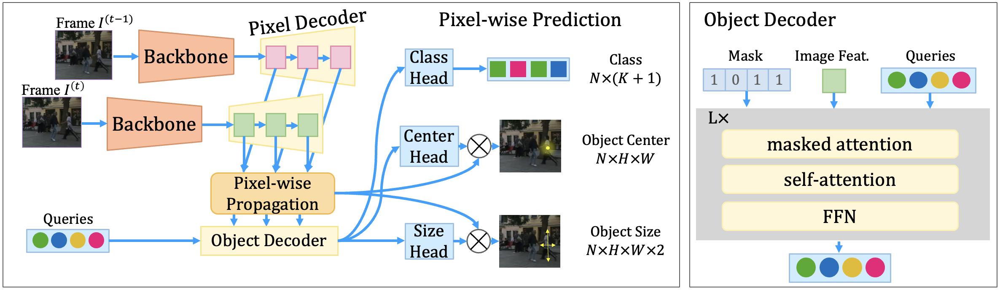
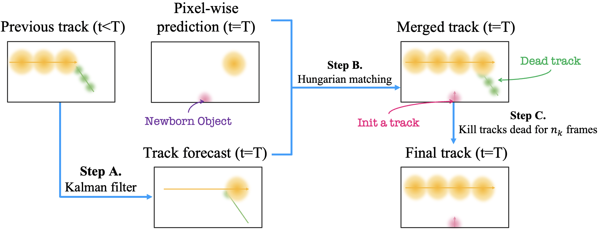
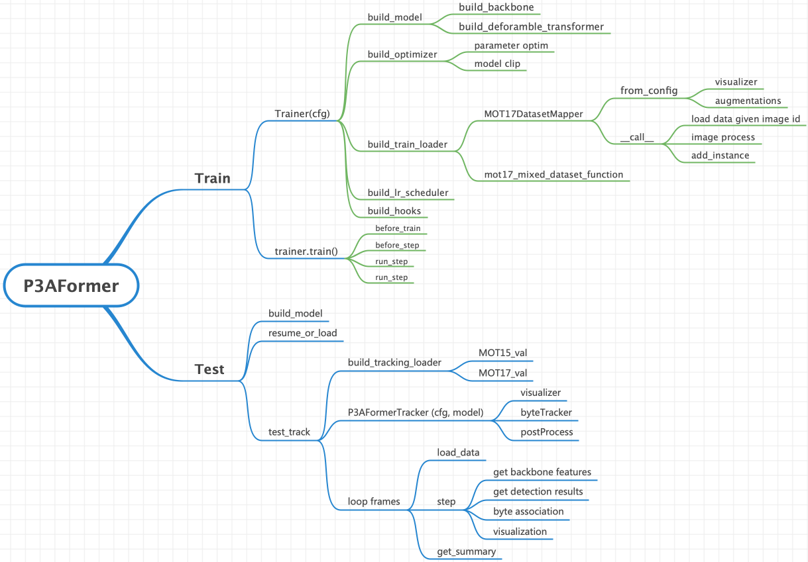

# [ECCV22 Oral] P3AFormer: Tracking Objects as Pixel-wise Distributions

This is the official code for our ECCV22 oral paper: <a href="https://arxiv.org/abs/2207.05518" target="_blank">tracking objects as pixel-wise distributions</a>.

Authors: [Zelin Zhao](https://sjtuytc.github.io/), Ze Wu, Yueqing Zhuang, Boxun Li, Jiaya Jia.

The proposed model diagram is:



The association scheme is:



## Installation

1. Install PyTorch and torch vision.
2. Install detectron2 following the official guidance.
3. Install other dependencies.

   ```bash
   pip install -r requirements.txt
   # install gdown to download datasets from Google.
   pip install gdown
   pip install --upgrade gdown
   ```

## Download datasets

1. Download [MOT17/MOT20](https://motchallenge.net/) from the official website. Alternately, you can download it via the following commands.

   ```bash
   mkdir data
   cd data
   wget https://motchallenge.net/data/MOT17.zip
   wget https://motchallenge.net/data/MOT20.zip
   unzip MOT17.zip
   unzip MOT20.zip
   wget https://motchallenge.net/data/MOT15.zip # optional
   unzip MOT15.zip 
   ```

2. Download [CityPersons](https://github.com/Zhongdao/Towards-Realtime-MOT/blob/master/DATASET_ZOO.md) from the official website. Alternately, you can download it via the following commands. When using the following commands, you need to have access to the google drive.

   ```bash
   gdown --no-cookies --id 1DgLHqEkQUOj63mCrS_0UGFEM9BG8sIZs
   gdown --no-cookies --id 1BH9Xz59UImIGUdYwUR-cnP1g7Ton_LcZ
   gdown --no-cookies --id 1q_OltirP68YFvRWgYkBHLEFSUayjkKYE
   gdown --no-cookies --id 1VSL0SFoQxPXnIdBamOZJzHrHJ1N2gsTW
   cat Citypersons.z01 Citypersons.z02 Citypersons.z03 Citypersons.zip > c.zip
   zip -FF Citypersons.zip --out c.zip
   unzip c.zip
   mv Citypersons Cityscapes
   ```

   You may need to retry the downloading if you find the "max retries" error. You may need to upgrade gdown if you meet the ["permission" error](https://github.com/wkentaro/gdown/issues/43). If you find the "End-of-centdir" error in unzip, you may need to redownload some of the downloaded files. If you meet the unzip error, you need to [recover the zip](https://github.com/Zhongdao/Towards-Realtime-MOT/issues/143) file first.

3. Download [CrowdHuman](https://www.crowdhuman.org/) from the official website. Alternately, you can download it via the following commands.

   ```bash
   gdown --no-cookies --id 134QOvaatwKdy0iIeNqA_p-xkAhkV4F8Y
   gdown --no-cookies --id 17evzPh7gc1JBNvnW1ENXLy5Kr4Q_Nnla
   gdown --no-cookies --id 1tdp0UCgxrqy1B6p8LkR-Iy0aIJ8l4fJW
   gdown --no-cookies --id 18jFI789CoHTppQ7vmRSFEdnGaSQZ4YzO
   gdown --no-cookies --id 1UUTea5mYqvlUObsC1Z8CFldHJAtLtMX3
   gdown --no-cookies --id 10WIRwu8ju8GRLuCkZ_vT6hnNxs5ptwoL
   # then unzip the downloaded files
   ```

4. Download [ETH](https://drive.google.com/file/d/19QyGOCqn8K_rc9TXJ8UwLSxCx17e0GoY/view?usp=sharing) from the official website. Alternately, you can download it via the following commands.

   ```bash
   gdown --no-cookies --id 19QyGOCqn8K_rc9TXJ8UwLSxCx17e0GoY
   unzip ETHZ.zip
   ```

5. Then symbol link the downloaded data to the data folder under the project root. The downloaded data should be like:

   ```bash
   data
   |——————mot # this is MOT17
   | └——————train
   | └——————test
   └——————crowdhuman
   | └——————Crowdhuman_train
   | └——————Crowdhuman_val
   | └——————annotation_train.odgt
   | └——————annotation_val.odgt
   └——————MOT20
   | └——————train
   | └——————test
   └——————Cityscapes
   | └——————images
   | └——————labels_with_ids
   └——————ETHZ
   └——————eth01
   └——————...
   └——————eth07
   ```

## Preprocess Dataset

Convert downloaded data to the standard COCO format. The preprocess tools are inherited from [ByteTrack](https://github.com/ifzhang/ByteTrack/tree/main/tools). PROJECT_ROOT is the root path to this project.

    ```bash
    cd ${PROJECT_ROOT}
    bash preprocess/data_preprocess.sh
    ```

## Training
1. CoCo pretraining:
```
bash configs/standard/v100_mot17_coco.sh
```

2. CrowdHuman pretraining:
```
bash configs/standard/v100_mot17_crowdhuman.sh
```

3. MOT17 training:
```
bash configs/standard/v100_mot17_fine_tune_mot17.sh
```

## Tracking
Get training performance scores (note this command needs only a 2080ti card to run):
```bash
bash configs/standard/v100_test_mot17.sh
```

Submit the results to MOT17 challenge website (note this command needs only a 2080ti card to run):
```bash
bash configs/standard/v100_submit_mot17.sh
```

## Result and Models on MOT17


|  Method   | Detector |           Train Set           |    Test Set    | Public | Inf time (fps) | HOTA | MOTA | IDF1 |  FP   |  FN   | IDSw. |                            Config                            |                                                                                                                                                           Download                                                                                                                                                           |
| :-------: | :------: | :---------------------------: | :------------: | :----: | :------------: | :--: | :--: | :--: | :---: | :---: | :---: | :----------------------------------------------------------: | :--------------------------------------------------------------------------------------------------------------------------------------------------------------------------------------------------------------------------------------------------------------------------------------------------------------------------: |
| P3AFormer | Our trained  | CrowdHuman + MOT17--train | MOT17-test |   N    |       -        | 55.9 | 69.3 | 68.9 | 19,275 | 151,200 |  2904  | [config](configs/standard/v100_mot17_coco.sh) | [model] \| [log] |

The Detectron2 version of the P3AFormer and the whitles and bells are not organized well yet (on another dev branch, will be merged into main branch soon), however, you may find the raw codes at [this Google drive link](https://drive.google.com/file/d/18NhDIvBNKyRFQYRdEKZkMO0m1hvNyt8L/view?usp=sharing).

## Code Structure

The code flow diagram is provided as follows:


## TODO List

- [ ] Jupyter notebook support for a quick demo.  
- [ ] YOLO-X style tracking objects as pixel-wise distributions.  

## Tips & QAs
1. What if the CUDA OOM happens when killing the program via "ctrl + C"?
   
   Try this command to kill all programs using GPUs, do not run this if you have other useful processes using GPUs:
   ```bash
   lsof /dev/nvidia* | awk '{print $2}' | xargs -I {} kill {}
   ```

2. How to develop?
   
   Using the debug scripts under the configs folder first and then run experiments on 2080Ti / V100.


## Citation & Acknowledgements

If you find our code helpful, please cite our paper:
```
@misc{zhao2022tracking,
      title={Tracking Objects as Pixel-wise Distributions}, 
      author={Zelin Zhao and Ze Wu and Yueqing Zhuang and Boxun Li and Jiaya Jia},
      year={2022},
      eprint={2207.05518},
      archivePrefix={arXiv},
      primaryClass={cs.CV}
}
```
If you have any questions, please contact me at: sjtuytc@gmail.com.


This code uses codes from MOTR, Transcenter-V1 and ByteTrack. Many thanks to their wonderful work. Consider citing them as well:

```
@inproceedings{zeng2021motr,
  title={MOTR: End-to-End Multiple-Object Tracking with TRansformer},
  author={Zeng, Fangao and Dong, Bin and Zhang, Yuang and Wang, Tiancai and Zhang, Xiangyu and Wei, Yichen},
  booktitle={European Conference on Computer Vision (ECCV)},
  year={2022}
}

@misc{xu2021transcenter,
      title={TransCenter: Transformers with Dense Representations for Multiple-Object Tracking}, 
      author={Yihong Xu and Yutong Ban and Guillaume Delorme and Chuang Gan and Daniela Rus and Xavier Alameda-Pineda},
      year={2021},
      eprint={2103.15145},
      archivePrefix={arXiv},
      primaryClass={cs.CV}
}

@article{zhang2022bytetrack,
  title={ByteTrack: Multi-Object Tracking by Associating Every Detection Box},
  author={Zhang, Yifu and Sun, Peize and Jiang, Yi and Yu, Dongdong and Weng, Fucheng and Yuan, Zehuan and Luo, Ping and Liu, Wenyu and Wang, Xinggang},
  booktitle={Proceedings of the European Conference on Computer Vision (ECCV)},
  year={2022}
}
```